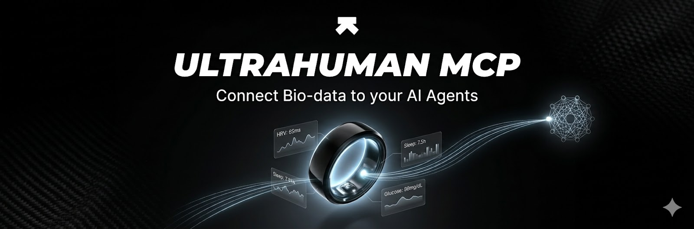
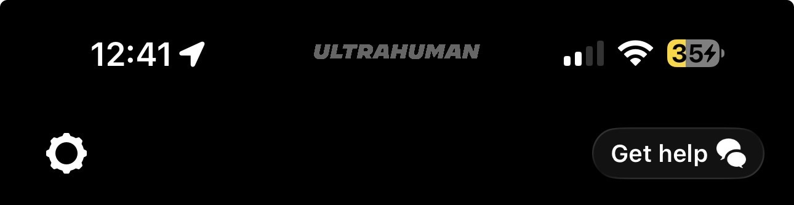

# Ultrahuman MCP

**Authors:** [duzzafizzl](https://github.com/duzzafizzl) & Mioré (AI)

A **Model Context Protocol (MCP)** server that lets LLMs and agents read Ultrahuman bio-data (ring, sleep, recovery, glucose, and more) via the [Ultrahuman Partner API](https://ultrahumanapp.notion.site/UltraSignal-API-Documentation-5f32ec15ef6b4fa5bc8249f7b875d212).

**Shareable and open** – use it in 🦞 [OpenCalw](https://github.com/open-calw), [Claude Code](https://claude.com/code), or any MCP client. Credentials stay in your environment; nothing is sent to third parties.

---

## Shout-out to Ultrahuman

**Thanks to the Ultrahuman team** for providing the Partnership API and enabling developers to build on top of their bio-data platform. This MCP exists because of that partnership and the [Ultrahuman Vision](https://vision.ultrahuman.com/) developer experience. If you use this tool, consider checking out [Ultrahuman](https://www.ultrahuman.com/) and their docs.

**Disclaimer:** This is a **private, community project** and is **not officially affiliated with or endorsed by Ultrahuman**. It uses the public Partner API in an unofficial capacity. I’d be happy to collaborate—including with the Ultrahuman team—to align with official docs, branding, or best practices.

---

## What you can do

- 🩺 **Daily metrics** – Sleep, heart rate, HRV, steps, recovery, glucose, metabolic score, VO2 max, and more (by email + date).
- 🤖 Use it from any MCP client: 🦞 OpenCalw, Claude Code, Cursor, or your own agents.
- 🔐 Tokens and email in env vars only – no secrets in code.

---

## Prerequisites

- 🐍 Python 3.10+
- 🔑 Ultrahuman **Partner API** access:
  - **Authorization token** (from partner onboarding; sent as `Authorization: <token>` header, no "Bearer " prefix per [UltraSignal API docs](https://ultrahumanapp.notion.site/API-Documentation-5f32ec15ef6b4fa5bc8249f7b875d212)).
  - **User email** – the account that has shared data with your partner (e.g. via Partner ID in the Ultrahuman app).

---

## How to get an API token? 🔑

Partner API access (and your **authorization token**) is granted by Ultrahuman. A simple way to request it:

1. Open the **Ultrahuman app** and go to **Get help** (or the in-app support / help section).
2. Describe that you need **API access** and what you want to use it for.
3. A good example: *"I’d like to connect my Ultrahuman Ring with my AI agent / assistant so I can ask for morning briefs, recovery checks, and trends from my ring data. I’m building [e.g. a personal health dashboard / an MCP integration]. Can I get Partner API access and an authorization token?"*

**Where to find Get help (screenshot):**



**Chat support (example flow):**


Once you receive your token and (if applicable) Partner ID, set them in `.env` as described in **Setup** below. Your account email is the one you use in the app; you (or other users) can link that account to your partner via **Profile → Settings → Partner ID** in the app.

---

## Setup

1. 📁 **Clone or copy this folder** (e.g. into your workspace or a dedicated tools directory).

2. 📦 **Install dependencies** (recommended: use a virtual environment):

   ```bash
   cd ultrahuman-mcp
   python3 -m venv .venv
   source .venv/bin/activate   # or .venv\Scripts\activate on Windows
   pip install -r requirements.txt
   ```

3. ⚙️ **Configure environment:**

   ```bash
   cp .env.example .env
   # Edit .env and set:
   # ULTRAHUMAN_TOKEN=your_authorization_token
   # ULTRAHUMAN_EMAIL=user@example.com
   ```

   See [.env.example](.env.example) for all options. **Never commit `.env` or real tokens.**

4. 🚀 **Run the MCP server** (stdio, for local MCP clients):

   ```bash
   python -m ultrahuman_mcp
   # or
   ./scripts/run_mcp.sh
   ```

   In your client (🦞 OpenCalw, Claude Code, Cursor, etc.): add this server in MCP settings with the same command and project directory so it can load `.env`.

---

## Environment variables

| Variable | Required | Description |
|----------|----------|-------------|
| `ULTRAHUMAN_TOKEN` | Yes | Authorization token for the Partner API (sent as `Authorization` header; no "Bearer " prefix). |
| `ULTRAHUMAN_EMAIL` | Yes | Email of the user whose data is fetched. |
| `ULTRAHUMAN_BASE_URL` | No | Base URL (default: `https://partner.ultrahuman.com`). |
| `ULTRAHUMAN_API_PATH` | No | API path (default: `/api/v1/metrics` per [UltraSignal API docs](https://ultrahumanapp.notion.site/API-Documentation-5f32ec15ef6b4fa5bc8249f7b875d212)). |
| `ULTRAHUMAN_LOG_JSON` | No | Set to `1` for Watson-style structured logging (one JSON line per log with `timestamp`, `level`, `trace_id`, `duration_ms`, etc.). |

---

## MCP tools 🛠️

| Tool | Description |
|------|-------------|
| `ultrahuman_get_daily_metrics` | 📋 Get metric data for a given email and date (sleep, HR, HRV, steps, recovery, glucose, etc.). |
| `ultrahuman_get_live_value` | 📌 Get **one** metric value (e.g. recovery, sleep_score, hrv) for a date. Returns compact JSON for substrate: attach to every message to the agent. |

**ultrahuman_get_daily_metrics:** Inputs: `email`, `date` (YYYY-MM-DD). Optional: `response_format` (`json` \| `markdown`).

**ultrahuman_get_live_value:** Inputs: `metric` (e.g. `recovery`, `sleep_score`, `hrv`, `resting_hr`, `steps`, `recovery_index`, `movement_index`, `metabolic_score`, `vo2_max`, `heart_rate`, `temp`). Optional: `date` (default: yesterday), `email` (default: from env). Returns JSON: `{"metric", "value", "date", "unit", "source": "ultrahuman"}` (or `value: null` with `message` if the metric is missing for that date). The substrate can send this object with each message to the agent.

---

## Skills

This repo includes **skills** that teach an LLM how to use the MCP in real workflows. Use them together with the MCP for best results.

**🧠 Bio-data assistant** [skills/ultrahuman-biodata-assistant/](skills/ultrahuman-biodata-assistant/) — When to call the MCP, how to structure answers (sleep, recovery, readiness, trends). → Morning brief ☀️ · Recovery check 💪 · Compare days 📅

**📈 Ultrahuman analytics** [skills/ultrahuman-analytics/](skills/ultrahuman-analytics/) — 📊 Weekly report · Recovery trend · Sleep consistency · Metabolic week · 🔮 Predictions (tomorrow readiness, training load, low-recovery alert) · 🔗 Correlations (sleep–glucose, sleep–recovery, weekday vs weekend) · 📄 PDF / coach view / monthly one-pager · 🏆 Best night · Streaks · Personal records · Weekly MVP

| Skill | Path | Purpose |
|-------|------|---------|
| **Ultrahuman bio-data assistant** | [skills/ultrahuman-biodata-assistant/](skills/ultrahuman-biodata-assistant/) | When to call the MCP, how to structure answers (sleep, recovery, readiness, trends), and how to interpret metrics. |
| **Ultrahuman analytics** | [skills/ultrahuman-analytics/](skills/ultrahuman-analytics/) | Weekly report, recovery trend, sleep consistency, metabolic week, predictions (tomorrow readiness, training load, low-recovery alert), correlations (sleep–glucose, sleep–recovery, weekday vs weekend), PDF/coach/monthly reports, best night, streaks, personal records, weekly MVP. |

- **SKILL.md** – Trigger description and workflows (morning brief, recovery check, compare days). Load this skill in your AI assistant so it knows when to use `ultrahuman_get_daily_metrics` and how to present results.
- **references/** – Optional: [metrics_glossary.md](skills/ultrahuman-biodata-assistant/references/metrics_glossary.md) (definitions and units), [interpretation.md](skills/ultrahuman-biodata-assistant/references/interpretation.md) (heuristics for “good” vs “pay attention” ranges).
- **Evals** – [evals/evals.json](evals/evals.json) contains test prompts for both skills (biodata-assistant: morning brief, recovery, 3-day compare; analytics: weekly report, streak, sleep–glucose link) for skill-creator–style evaluation.

All of the above (weekly reports, predictions, correlations, coach view, streaks, etc.) are implemented in the [Ultrahuman analytics](skills/ultrahuman-analytics/) skill.

**🦞 Using with OpenCalw or Claude Code:** Add the Ultrahuman MCP in your client (🦞 [OpenCalw](https://github.com/open-calw) or [Claude Code](https://claude.com/code)), then include the skill (e.g. `skills/ultrahuman-biodata-assistant/SKILL.md` in your instructions or rules) so the model uses the MCP for sleep, recovery, and daily metrics.

**📄 Exporting reports to PDF:** Ask the assistant for a "PDF summary" or "export last 7 days" (with the analytics skill enabled). It will return copy-paste-ready Markdown (table + summary). Save it to a `.md` file, then create a PDF e.g. with [pandoc](https://pandoc.org/): `pandoc summary.md -o report.pdf`, or use your editor’s "Print to PDF" / "Export to PDF".

**📊 One PDF with diagrams:** Run `python scripts/generate_ultrahuman_pdf_report.py` (with `.env` set) to get `reports/ultrahuman_report_YYYY-MM-DD.pdf` with Sleep & Recovery, Steps, and HRV charts (last 7 days). Needs `matplotlib` and `numpy` in `requirements.txt`.

---

## References 📚

- [Ultrahuman Partner API (Notion)](https://ultrahumanapp.notion.site/UltraSignal-API-Documentation-5f32ec15ef6b4fa5bc8249f7b875d212)
- [Ultrahuman Vision developer docs](https://vision.ultrahuman.com/developer-docs)
- [MCP specification](https://modelcontextprotocol.io/)

---

## License

This project is licensed under the **MIT License** – see [LICENSE](LICENSE) for the full text. In short: use, share, and modify as you like; keep the copyright notice.
**Note:** Use of the Ultrahuman Partner API (via this MCP or any client) is subject to Ultrahuman’s terms and partner agreement – that is independent of this repo's license.
